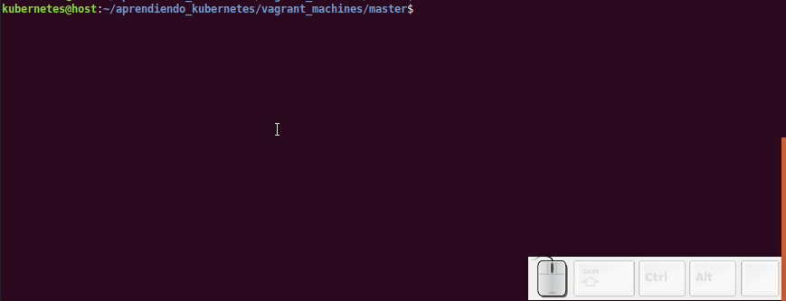
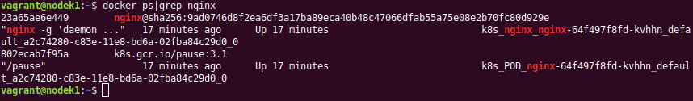

# Desplegando un servidor WEB nginx.

## 1) Utilizanod el comando run con el controlador k8s desplieque y verifique un nginx.

Ingrese al master con **vagrant ssh** y ejecute el siguiente comando.
```
  kubectl run nginx --image nginx
```

Verifique que la aplicación fue desplegadas

```
  kubectl get deployments
```


Adicionalmente pude verificar los contenedores desplegados

**En Master:**
``` docker ps|grep nginx``` la salida debería ser vacia.

**En Node1:** ```docker ps|grep nginx``` debe ser muy similar a la siguiente imagen.



Sin embargo este servicio no puede ser accedido desde afuera aún.

## 2) Exporte la configuración de este despliegue y borrelo.

Para exportar use el sigueinte comando en el **Master**:

```
kubectl get deployment nginx -o yaml > /vagrant/primer_nginx.yaml
```

Para **eliminarlo** use:
```
kubectl delete deployment nginx
```

El archivo de configuración exportado esta ahora en su carpetepeta ~/aprendiendo_kubernetes/vagrant_machines/master puede explorarlo y usarlo para desplegar nuevamente el nginx.

## 3) Desplegar **nginx** usando *create*
```
kubectl create -f /vagrant/primer_nginx.yaml
```
Haga nuevamente la verificación de los despliegues.

## 4) Exponiendo nginx en el puerto 80

Edite el archivo **primer_nginx.yaml**

---
Original
```
...
spec:
   containers:
   - image: nginx
     imagePullPolicy: Always
     name: nginx
     resources: {}
...

```
---
Modificado
```
...
spec:
   containers:
   - image: nginx
     imagePullPolicy: Always
     name: nginx
     ports:
     - containerPort: 80
       protocol: TCP
     resources: {}
...
```
---
Se adicionaron tres líneas en la sección **ports**. Luego de modificar el archivo elimine y cree nuevamente el Pod.

kubectl get deploy, pod
kubectl expose deployment/nginx
kubectl get service nginx
kubectl get ep nginx
