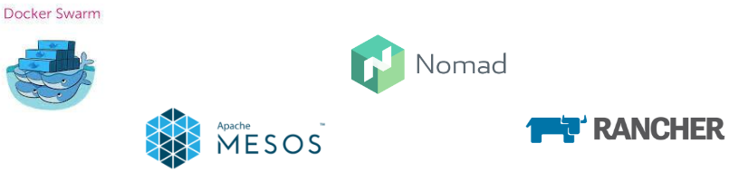

# Kubernetes
## Vagrant Lab.
Esta sección contiene indicaciones para iniciar una configuración local de Kubernetes usando [Vagrant](https://www.vagrantup.com/)

[VagrantLab](VagrantLab.md)

## Qué es Kubernetes?
Es un orquestador de contenedores que permite la administración de los mismos durante su ciclo de vida, desde el desarrollo hasta el momento de reclamar los recursos que estos utilizan.

                         Orquestar
                           /\
                          /  \
                         / da \
                        /      \
                       /        \
            Escalabilidad ___ Tolerancia a
                               fallos
**NOTA:** Kubernetes viene de la palabra griega usada para denominar al Piloto.

Tiene sus orígenes en Borg , un proyecto de Google, antes de entregarlo a la comunidad lo usaron por 15 años.

## Propiedades de Kubernetes

* Desacoplado
* Transitivo: Sus componentes pueden desconetarse y reconectarse en cualquiermomento.

También se le nombra cómo K8s y se pronuncua Kate's

## Microservicios

En micro servicios cada aspecto de una aplicación tradicional es remplazado con un dedicado pero transitivo agente. Estos agentes se pueden usar entresí por medio de un API.

## Configuración de Kubernetes

La configuración es almacenada en JSON, pero es escrita en YAML los agentes de K8s los pasan a JSON pra persistirlos.

## Contenedores Docker

Los contenedores han incrementado fuertemente la experiencia de desarrollo, permitiendo compartir imágenes por medio de Docker regisry, sin embargo la complejidad para manejarlos y escalarlos es todo un reto.

## Desarrollo con Contenedores

Para poder aprovechar su potneciál se requiere CI y un pipeline bien definido que permita construir, probar y verificar la imagenes.

Se require una infraestructura de red y almacenamiento que se comporte de manera flexible.

### Otras soluciones similares

## La herencia de Borg

https://ai.google/research/pubs/pub43438

## Componentes de los Minios

**Kubelet:** Es el encargado de recibir las ornes para ejecutar contenedores en los nodos.

**Kube-Proxy:** Maneja las reglas de red para exponer el contenedor.

**Orquestación:** Es manejada por medio de una serie de **Controladores**

**Controlador:** Es el encargado de preguntar al kube-apiserver el estado de objetos específicos.

**Deployment:** Es un controlador por defecto lleno de características, asegura que recursos como: IP, almacenamiento y un espacio de nombres, esten disponibles para deplegar los **ReplicaSet**

**ReplicaSet:** Es un controlador para desplegar y reiniciar controladores (generalmente Docker), hasta que los contenedores solicitados esten corriendo.

**Jobs y CronJobs**: Son los encargados de manejar tareas repetitivas.

## Importancia del etiquedado

Manejar miles de Pods y cientos de Nodos pude ser una tarea abrumadora, por ello es importante tener un buen etiquetado (**labels**) de los contenedores, lo que permite facilitar y automatizar el trabajo.

Estas etiquetas se convierten en la metadata de los objetos.

## Lecturas para realizar

https://apprenda.com/blog/happy-1st-birthday-kubernetes-infographic/

Pokemon Go on kubernetes

https://cloudplatform.googleblog.com/2016/09/bringing-Pokemon-GO-to-life-on-Google-Cloud.html

Recursos de la comunidad de kubernetes

https://github.com/kubernetes/community

Cómo seleccionar la solución correcta de k8s

https://kubernetes.io/docs/setup/pick-right-solution/

## Kubernetes tools

**Minukube**: Ambiente virtual mínimo, permite configurar un cluster de kubernetes en una máquian sigular.

**kubeadm**: Facilita el manejo de kubernetes sin usar intaladores específicos de un vendedor. Consta de dos comandos **kubeadm init** para iniciar le nodo master y **kubadm join** para unirse nodos de trabajo a un cluster.

**hyperkube**: Es un contenedor que puede iniciarse en diferentes nodos para crear un cluster de k8s
kubectl

**Kcompose**: Para migrar proyectos de compose a kubernetes

## Container Network Interface (CNI)

Hay varias opciones de red con las que los Pod pueden interactuar.
La red debe permitir comunicación contenerdor-a-contenedor, pod-a-pod y pod-a-servicio.
Solo pude existir un tipo de red por cluster.

[Red Fannel](https://raw.githubusercontent.com/coreos/flannel/master/Documentation/kube-flannel.yml)
Esta red define una red(network) en el segmento 10.244.0.0/16.

[Red Calico](https://docs.projectcalico.org/v2.6/getting-started/kubernetes/installation/hosted/kubeadm/1.6/calico.yaml)
Esta red define una red(network) en el segmento 192.168.0.0/16 y tiene mayores prestaciones de seguridad por medio del uso de políticas de red.

Una rede debe eser considerada libre de conflictos con las IPs, por ello las diferentes versiones.

  Otras redes:  kube-router, romana, weave net
## Cosas a revisar
### Para instalar en ubuntu 18.04 bionic
https://linuxconfig.org/how-to-install-kubernetes-on-ubuntu-18-04-bionic-beaver-linux
