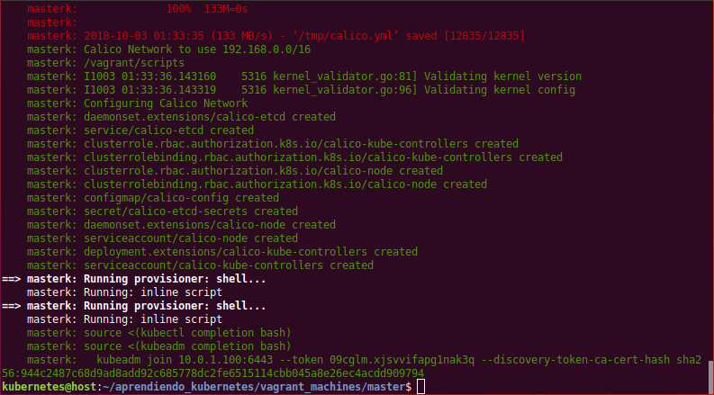
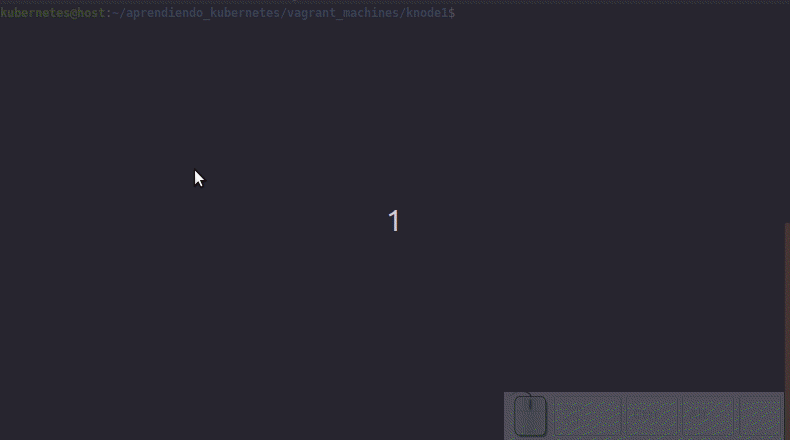
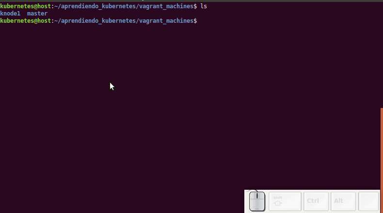
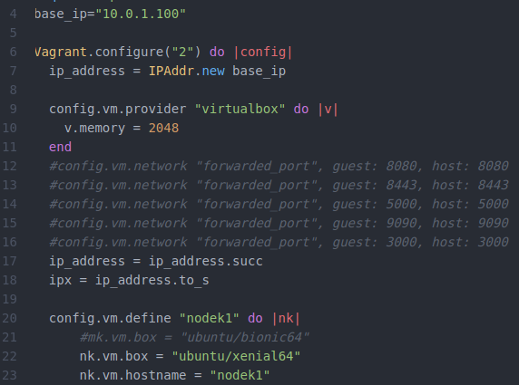

# Vagrant Lab

Para ejecutar este laboratorio usted debe tener instalado en su computador Virtualbox y Vagrant.

## 1) Clone o descague este repositorio

   **git clone**
    https://github.com/tutmosisII/aprendiendo_kubernetes.git
    

   **Descarga: **
   https://github.com/tutmosisII/aprendiendo_kubernetes/archive/master.zip

---

## 2) Inicie nodo master

Vaya hasta la carpeta vagrant_machine/master y ejecute el siguiente comando.

    vagrant up

  

Cuado la creación del master ha finalizado se produce una salida similar a esta:

  

En este punto usted ha inicializado un nodo master de k8s usando la red de calico.

La úlitma linea muestra el comando **kubeadm join** con las llaves secretas que se generaron para adicionar nodos al cluster.

## 3) Vinculando un Nodo (minion)

Ingrese a la carpeta vagrant_machine/knode1 y ejecute **vagrant up**

Al finalizar el aprovisionamiento de la máquina virtual ingrese a esta y pegue el  comando **kubeadm join ...** generado en el paso 2, no olvide usar **sudo**.

    vagrant ssh

  

## 4) Verificar el estado del Cluster

Usted puede verificar el estado del master creado usando los siguientes comandos:

    vagrant ssh
    kubectl get nodes

Una vez listados los nodos tome el nombre (NAME) del master y úselo para leer la descripción.

    kubectl describe node <node_name>

Pude verificar También que los pods de [calico](https://www.projectcalico.org/) están corriendo.

Ahora tiene un cluster de kubernetes conformado por un master y un node. Pruebe copiando la carpeta knode1 y creando un segundo nodo para adicionarlo al cluster, en el archivo **Vagrantfile** del segundo nodo modifique la IP y el nombre (lineas 4 y 23 de la imagen), luego repita el proceso del paso 3.

